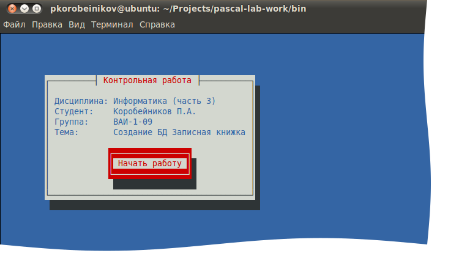
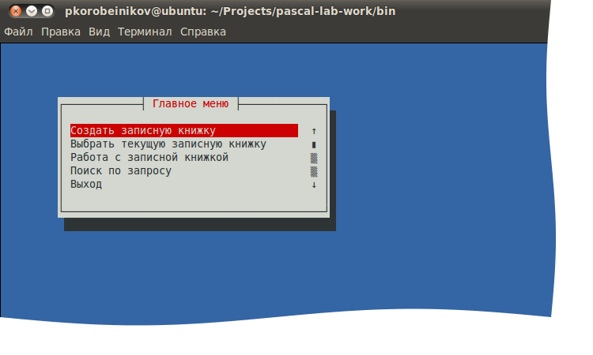
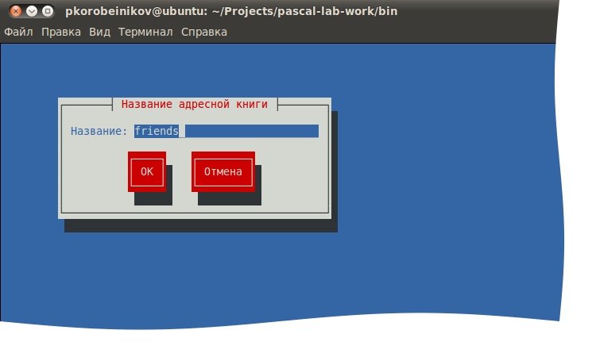
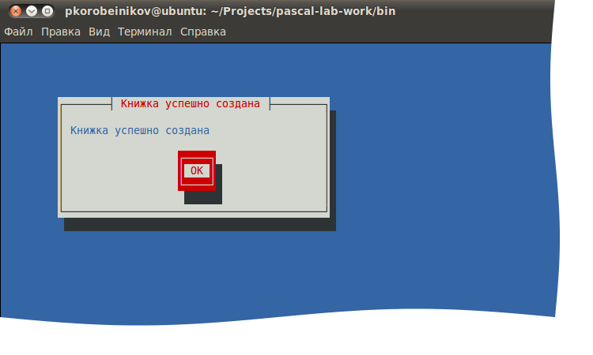
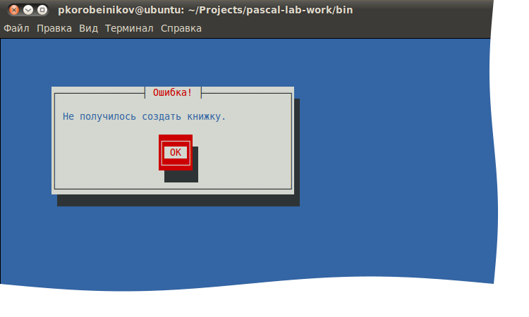

# pascal-lab-work 💾

Just accidentally found my ancient laboratory work written (and incomplete)
in Pascal in the first or second year of my degree
at Moscow Institute of Radio Engineering, Electronics, and Automation (MIREA).

It uses `newt` for a widget-based user interface.
MS-DOS is not supported (but the professor didn't know about that 🤣).

There are some UI screenshots for examples:

Just found it funny 🤪
